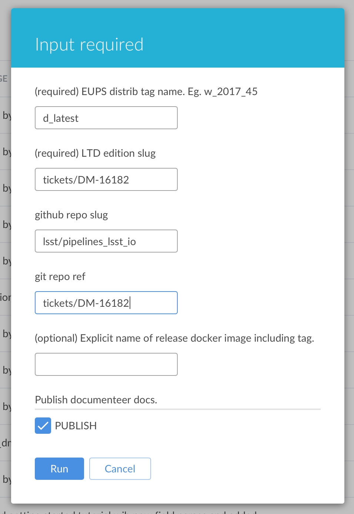

.. _jenkins-pipelines-lsst-io-build:

################################################################
Building pipelines.lsst.io with Jenkins (sqre/infra/documenteer)
################################################################

`pipelines.lsst.io`_ is automatically built and deployed for each ``lsst_distrib`` build.
You don't manually build and update the website when you contribute to the `pipelines_lsst_io`_ documentation repository.

You can, however, preview a development branch of the `pipelines_lsst_io`_ repository by manually running the `sqre/infra/documenteer`_ Jenkins CI job.
Since `pipelines.lsst.io`_ is published through LSST the Docs, builds for development branches appear as new editions from the `pipelines.lsst.io/v <https://pipelines.lsst.io/v>`__ version dashboard.

.. important::

   You can't use this Jenkins CI job to test development branches of packages with the `pipelines.lsst.io`_ site build.
   This Jenkins CI job always uses packages corresponding to a released EUPS tag (such as a daily, weekly, or stable release).
   Only the branch of the `pipelines_lsst_io`_ repository can be modified.

   If you need to build and test your package’s documentation, you can do so locally with these methods:

   - :doc:`building-pipelines-lsst-io-locally`
   - :doc:`building-single-package-docs`

.. _jenkins-pipelines-lsst-io-build-example:

Example
=======

This section describes how most contributors will use the `sqre/infra/documenteer`_ Jenkins job: to preview a ticket branch of the pipelines_lsst_io_ repository.
In this example, the ticket branch is called ``tickets/DM-16182``.

First, go to the `sqre/infra/documenteer`_ job’s page, then click the **Run** button.
Then fill in the fields as shown in the following screenshot.

Here is more detail about each field:

:ref:`EUPS distrib tag name <jenkins-pipelines-lsst-io-build-eups-distrib-tag-name>`: ``d_latest``
    The ``d_latest`` EUPS tag automatically aliases the most recent EUPS daily build tag.
    Using ``d_latest`` here is useful because when you're writing new content for the `pipelines_lsst_io`_ repository, you often want to pair it with the latest version of the ``lsst_distrib`` package.

:ref:`LTD edition slug <jenkins-pipelines-lsst-io-build-ltd-edition-slug>`: ``tickets/DM-16182``
    LSST the Docs uses this field to build the "slug," or ``/v/<slug>/`` URL path prefix, for alternative documentation editions.
    In this case, you want to use the name of the branch in the pipelines_lsst_io_ repository to identify the edition as corresponding to the ``tickets/DM-16182`` development branch.
    LSST the Docs automatically transforms this value into the ``/v/DM-16182`` path prefix.

:ref:`github repo slug <jenkins-pipelines-lsst-io-build-github-repo-slug>`: ``lsst/pipelines_lsst_io``
    Always use this value.

:ref:`git repo ref <jenkins-pipelines-lsst-io-build-github-repo-ref>`: ``tickets/DM-16182``
    This field determines which branch of the GitHub repository (pipelines_lsst_io_) to clone and build.
    Use the development ticket branch, ``tickets/DM-16182``.

Publish
    Leave this field checked so that the built documentation site is published to the web.
    You can find the edition at https://pipelines.lsst.io/v.

Field reference
===============

This section has more information about each configuration field.

.. _jenkins-pipelines-lsst-io-build-eups-distrib-tag-name:

EUPS distrib tag name
---------------------

This is the EUPS tag of the ``lsst_distrib`` Stack that populates the package and module documentation that's building alongside the main pipelines_lsst_io_ repository.
You can set this field to a major release, weekly release, or a daily release.
Examples:

- Major release example: ``16_0``.
- Weekly release example: ``w_2018_01``.
- Daily release example: ``d_2018_01_01``.

You can also use these aliases:

- Latest weekly tag: ``w_latest``.
- Latest daily tag: ``d_latest``.

.. note::

   This field means that you can only build documentation for tags of Stack packages that have been released by Jenkins CI.

.. _jenkins-pipelines-lsst-io-build-ltd-edition-slug:

LTD edition slug
----------------

Set this field to either a **Git ref** or an **EUPS tag**.
LSST the Docs uses this information to populate the version slug of the edition (the part of the URL directly after ``/v/``).

Follow these guidelines:

- If you are building with a non-\ ``master`` Git ref of the `pipelines_lsst_io`_ repository (see :ref:`jenkins-pipelines-lsst-io-build-github-repo-ref`), set this field to the name of the `pipelines_lsst_io`_ branch being built.

  Example: you have a branch called ``tickets/DM-16182`` in the `pipelines_lsst_io`_ repository.
  Set this field to ``tickets/DM-16182``.
  LSST the Docs automatically transforms this value into the ``/v/DM-16182/`` edition path prefix.

- If you are rebuilding documentation for a *released* version of the ``lsst_distrib`` package, set this field to the name of the corresponding EUPS tag.

  Example: you are rebuilding documentation for the ``d_2018_10_29`` EUPS tag of ``lsst_distrib``.
  Set this field to ``d_2018_10_29``.

  Note: you generally will never do this as developer contributing new content.

.. _jenkins-pipelines-lsst-io-build-github-repo-slug:

github repo slug
----------------

This is the GitHub repository slug for the :ref:`main documentation repository <stack-docs-system-main-repo>`.
This should always be ``lsst/pipelines_lsst_io``.

.. _jenkins-pipelines-lsst-io-build-github-repo-ref:

git repo ref
------------

This is the name of the Git branch, tag, or commit SHA of the :ref:`main documentation repository <stack-docs-system-main-repo>` (`pipelines_lsst_io`_) that you want to build.

If you are building a ticket branch of `pipelines_lsst_io`_, this is the name of that ticket branch.
It will be the same as the string you set on the :ref:`jenkins-pipelines-lsst-io-build-ltd-edition-slug` field, above.

If you are building an EUPS release, set this field to the name of the Git branch, tag or commit SHA corresponding to the EUPS tag.

.. _jenkins-pipelines-lsst-io-docker-image:

Explicit name of release docker image including tag
---------------------------------------------------

Leave this field blank.

.. _jenkins-pipelines-lsst-io-build-run-job:

Run the Job
-----------

Ensure that the **Publish** option is checked so that the build site is published as a development branch on `pipelines.lsst.io`_.

.. _jenkins-pipelines-lsst-io-build-view-results:

Viewing the results
===================

Once the job successfully finishes, open `pipelines.lsst.io/v`_ and find the corresponding edition that you just built.

.. _`pipelines.lsst.io`: https://pipelines.lsst.io
.. _`pipelines.lsst.io/v`: https://pipelines.lsst.io/v
.. _`pipelines_lsst_io`: https://github.com/lsst/pipelines_lsst_io
.. _`sqre/infra/documenteer`: https://ci.lsst.codes/blue/organizations/jenkins/sqre%2Finfra%2Fdocumenteer/activity
